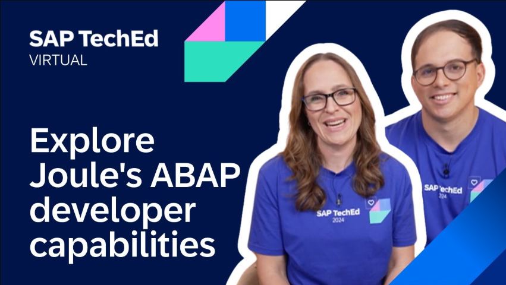

[Home - Workshops about the ABAP RESTful Application Programming Model (RAP) ](https://github.com/SAP-samples/abap-platform-rap-workshops/blob/main/README.md)

<!--  -->

<!--
# SAP-samples/repository-template
This default template for SAP Samples repositories includes files for README, LICENSE, and .reuse/dep5. All repositories on github.com/SAP-samples will be created based on this template.

# Containing Files

1. The LICENSE file:
In most cases, the license for SAP sample projects is `Apache 2.0`.

2. The .reuse/dep5 file: 
The [Reuse Tool](https://reuse.software/) must be used for your samples project. You can find the .reuse/dep5 in the project initial. Please replace the parts inside the single angle quotation marks < > by the specific information for your repository

3. The README.md file (this file):
Please edit this file as it is the primary description file for your project. You can find some placeholder titles for sections below.
-->

# RAP120 - Build SAP Fiori Apps with ABAP Cloud and SAP Joule for developers

<!-- Please include descriptive title test -->

<!--- Register repository https://api.reuse.software/register, then add REUSE badge:

-->

## Description
<!-- Please include SEO-friendly description -->

This repository contains the material for the hands-on session **RAP120 - Build SAP Fiori Apps with ABAP Cloud and SAP Joule for developers**💎

**Table of Content**
- [Requirements for attending this workshop](#requirements-for-attending-this-workshop)
- [Overview](#overview)
- [Exercises](#exercises)
- [Recordings](#recordings)
- [Solution Package](#solution-package)
- [Known Issues](#known-issues)
- [How to obtain support](#how-to-obtain-support) 
- [Further Information](#further-information)

## Requirements for attending this workshop
[^Top of page](#)

> To complete the practical exercises in this workshop, you need the latest version of the ABAP Development Tools for Eclipse (ADT) on your laptop or PC and the access to a suitable ABAP system* that is connected to the [SAP AI Core](https://discovery-center.cloud.sap/serviceCatalog/sap-ai-core).
> 
> The appropriate flavor of the [ABAP Flight Reference Scenario](https://github.com/SAP-samples/abap-platform-refscen-flight) must be imported into the relevant system.  
> 
> (*) SAP BTP ABAP environment and SAP S/4HANA Cloud Public Edition - as of release 2505 - are currently supported.
>
>> #### ⚠ Exception regarding SAP-led events, such as "ABAP Developer Day" and "SAP CodeJam"   
>> → A dedicated ABAP system for the hands-on workshop participants will be provided.   
>> → Access to the system details for the workshop will be provided by the SAP instructors during the session.

  
🔵Click to expand!

  The requirements to follow the exercises in this repository are:
  1. [Install the latest Eclipse platform and the latest ABAP Development Tools (ADT) plugin](https://developers.sap.com/tutorials/abap-install-adt.html)
  2. [Create an ABAP Cloud Project in your ADT installation](https://developers.sap.com/tutorials/abap-environment-create-abap-cloud-project.html)
  3. [Adapt the Web Browser settings in your ADT installation](https://github.com/SAP-samples/abap-platform-rap-workshops/blob/main/requirements_rap_workshops.md#4-adapt-the-web-browser-settings-in-your-adt-installation)   

## Overview
[^Top of page](#)

<!-- #### Current Business Scenario -->

> In this hands-on session, you will learn how to use ABAP capabilities in SAP Joule for Developers, including predictive code completion, unit test generation 
> for ABAP CDS and ABAP code, and code explanation to speed up your development with ABAP Cloud.

  
🔵Click to expand!

   
  This hands-on workshop dives into creating and testing a transactional SAP Fiori elements app with Joule, using the ABAP RESTful Application Programming Model (RAP) and its UI services.

  You will build a simple transactional app to manage travel bookings based on a managed business object (BO) with a single node _Travel_.

  ABAP Cloud is the development model for building clean core compliant apps, services, and extensions on SAP S/4HANA Cloud, SAP S/4HANA, and SAP BTP ABAP environment. ABAP Cloud covers different development scenarios such as transactional, analytical, intgeration, and enterprise search scenarios. RAP ist at the heart of ABAP Cloud for building transactional SAP Fiori apps, OData-based Web API, local APIs, and business events.

  The resulting app will look like this:

  

## Exercises
[^Top of page](#)

Follow these steps to build a SAP Fiori App with Joule in ABAP Cloud

| Exercises | -- |
| ------------- |  -- |
| [Getting Started](exercises/ex0/README.md) | -- |
| [Exercise 1: Generate a SAP Fiori app using the ABAP Cloud Generator: Transactional App from Scratch](exercises/ex01/README.md) | -- |
| [Exercise 2: Enhance the CDS data model and Create CDS unit tests](exercises/ex02/README.md) | -- |
| [Exercise 3: Analyze the ABAP helper class and create ABAP unit tests](exercises/ex03/README.md) | -- |
| [Exercise 4: Add a validation](exercises/ex04/README.md) | -- |
| [Exercise 5: Add a determination](exercises/ex05/README.md) | -- |

#### Optional Exercise: ABAP Cloud Generator - Transactional App from Scratch

| Exercises | -- |
| ------------- |  -- |
| [Exercise 6: Add a determination and enhance it with the ABAP AI SDK powered by ISLM](exercises/ex06/README.md) | -- |
| [Exercise 7: Play around with the ABAP Cloud Generator - Transactional App from Scratch](exercises/ex07/README.md) | -- |

   
## Recordings
[^Top of page](#)

▶️ Watch the replay of the virtual **TechEd 2024 Session: Explore SAP Joule for developers, with ABAP AI capabilities**.

<!-- ## 📤Solution Package
[^Top of page](#)

> You can import this solution package **`ZRAP120_SOL`** into following ABAP systems:
> - SAP BTP ABAP environment
> - SAP S/4HANA Cloud Public Edition 
> - SAP S/4HANA Cloud Private Edition and SAP S/4HANA as of Release 2022. 
>
> The [ABAP Flight Reference Scenario](https://github.com/SAP-samples/abap-platform-refscen-flight) must be available in the relevant system before importing the solution package.

Click to expand!

  
Follow the instructions provided below to import the solution into your publc cloud system - i.e. SAP BTP ABAP environment and SAP S/4HANA Cloud Public Edition.

1. [Install the abapGit plugin in your ABAP Development Tools (ADT) for Eclipse](https://developers.sap.com/tutorials/abap-install-abapgit-plugin.html) if you have not already done so.
2. In ADT, create the ABAP package **`ZRAP100_SOL`** in your system.
3. Open the **abapGit Repositories** view in ADT and follow the steps below.  
4. Create a link to the repository using the **Link abapGit Repository** window.    
    📤 Git repository URL: `https://github.com/SAP-samples/abap-platform-rap100`
5. Now pull/import the solution implementation using the context menu _**Pull...**_.
6. Activate the imported development objects (**Ctrl+Shift+F3**).

    -->

## ⚠Known Issues
No known issues. 

## 🆘How to obtain support
[Create an issue](../../issues) in this repository if you find a bug or have questions about the content.
 
For additional support, [ask a question in SAP Community](https://answers.sap.com/questions/ask.html).

## Further Information
[^Top of page](#)

You can find more information about the generative AI in ABAP, ABAP Cloud, RAP here:

- [Generative AI in ABAP Cloud](https://help.sap.com/docs/abap-ai/generative-ai-in-abap-cloud/generative-ai-in-abap-cloud?locale=en-US) 
- [ABAP Cloud Roadmap Information - GenAI](https://help.sap.com/docs/abap-cross-product/roadmap-info/genai?locale=en-US)
- [ABAP AI Strategy Frequently Asked Questions ](https://www.sap.com/documents/2024/11/6c0a3705-e77e-0010-bca6-c68f7e60039b.html)
- [ABAP Cloud development model](https://help.sap.com/docs/abap-cloud)
- [Getting Started with ABAP RESTful Application Programming Model (RAP)](https://pages.community.sap.com/topics/abap/rap)

<!--
## Contributing
If you wish to contribute code, offer fixes or improvements, please send a pull request. Due to legal reasons, contributors will be asked to accept a DCO when they create the first pull request to this project. This happens in an automated fashion during the submission process. SAP uses [the standard DCO text of the Linux Foundation](https://developercertificate.org/).
-->

## License
Copyright (c) 2025 SAP SE or an SAP affiliate company. All rights reserved. This project is licensed under the Apache Software License, version 2.0 except as noted otherwise in the [LICENSE](LICENSE) file.
