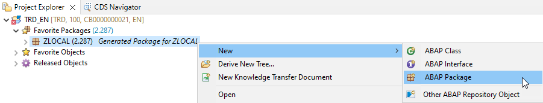
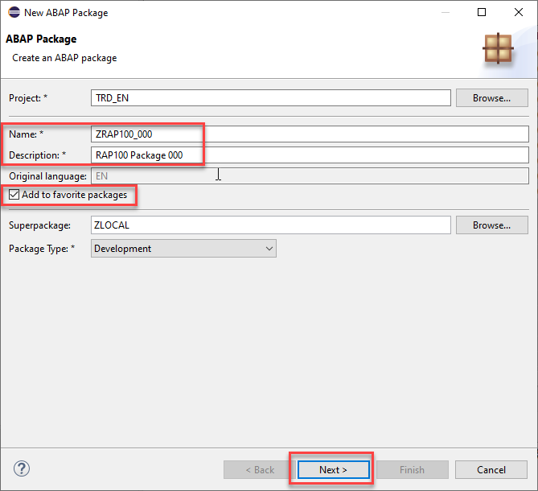
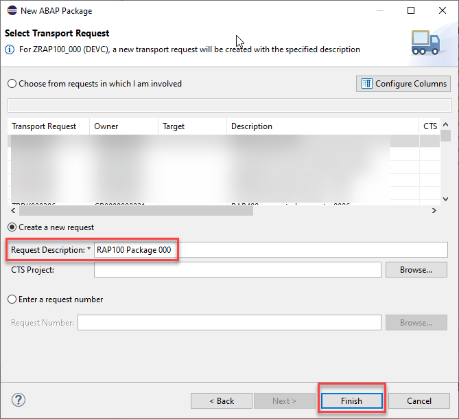

[Home - RAP120](../../README.md)

# Exercise 1: Generate a SAP Fiori using the ABAP Cloud Generator: transactional app from scratch 

## Introduction

In this exercise, you will create a transactional UI service along with the underlying RAP business object to process _Travel_ entities. 

First, you'll create an ABAP package, a database table, and an ABAP class to populate the database table with demo data. Using **ABAP Cloud Generators: Transactional App from Scratch💎**, you will input a natural language prompt describing the application, and all its artifacts will be generated. This includes the CDS data model, behavior definition, behavior implementation class, service definition, and service binding. After that, you'll publish and check your Travel application using the SAP Fiori elements preview.

> Refer to the [ABAP Cloud Roadmap Information - GenAI](https://help.sap.com/docs/abap-cross-product/roadmap-info/genai?locale=en-US) for more details.

### Exercises
- [1.1 - Create package](#exercise-11-create-package)
- [1.2 - Generate the transactional UI service](#exercise-12-generate-the-transactional-ui-service)
- [1.3 - Adjust metadata extension](#exercise-13-Adjust-metadata-extension)
- [1.4 - Publish and preview the _Travel_ app](#exercise-14-publish-and-preview-the-travel-app)
- [1.5 - Create an helper class](#exercise-15-create-an-helper-class)
- [Summary & Next exercise](#summary--next-exercise)
 
 
> ℹ️ **Reminder:**    
> - Don't forget to replace all occurences of the placeholder **`###`** with your group ID in the exercise steps below.  
> - You can use the ADT function **Replace All** (**Ctrl+F**) for the purpose.   
> - If you don't have a group ID yet, then check the section [Getting Started - Group ID](../ex0/README.md#group-id) to define a suffix for your artifacts.    

## Exercise 1.1: Create package
[^Top of page](#Introduction)

> Create your exercise package **`ZRAP120_AI_###`**.
>    
> This ABAP package will contain all the artifacts you will be creating in the different exercises of this hands-on session.

 <details>
  <summary> 🔵 Click to expand!</summary>

   1. In ADT, go to the **Project Explorer**, right-click on the package **`ZLOCAL`**, and select **New** > **ABAP Package** from the context menu. 

      
   
   2. Maintain the required information: 
      > Note: **`###`** is your assigned group ID or you can choose your own suffix. Please choose a suitable combination of three (3) numbers and characters, e.g. **`476`** or **`ZT1`**
 
       - Name: **`ZRAP120_AI_###`**
       - Description: _**`RAP AI Package ###`**_
       - Select the box `☑️` **Add to favorites package**
       - Superpackage: **`ZLOCAL`**
       
      Click **Next >**.

      <!--  -->
   
   3. Select a transport request, maintain a description (e.g. _**RAP120 Package ###**_) if needed, and click **Finish**.
      
      <!--  -->

</details>


## Exercise 1.2: Generate the transactional UI service
[^Top of page](#Introduction)
> Generate an OData UI service using the ABAP Cloud Generator: Transactional app from scratch 💎

 <details>
  <summary> 🔵 Click to expand!</summary>

   1. Right-click on your ABAP package **`ZRAP120_AI_###`** and select **Generate ABAP Repository Objects** from the context menu.
      
      Select the entry **OData UI Service from Scratch** in the wizard and click **Next >**.
      
      Maintain your package name **`ZRAP120_AI_###`** and click **Next >**.                  

   2. Please copy and paste the prompt provided below in the chat, and press **Enter**. Ensure to replace `###` with your chosen suffix.
      
      ```PROMPT
      Create a transaction application for travel management. Create the entity Travel based on the structure /DMO/TRAVEL_DATA. 
      The second entity is Booking based on /DMO/BOOKING_DATA. The generated objects should end with  suffix “###”
      ```
 
   3. Joule will recommend the Business Object entities _Travel_ and _Booking_ along with their respective fields. Press **Accept**.
 
      > ℹ️ NOTE: The names of the artifacts, database fields, and other elements in your project may differ from those shown in this tutorial, as they are generated by GenAI
       
   4. You can add new fields to the entities either by using the wizard or the chat. We will use this feature and add two fields called **`Destination`** and **`DiscountedFlightPrice`**.   
      To do so, copy and paste the prompt provided below, and press **Enter**
      
      ```PROMPT
         Add  Destination field for entity Travel, use /DMO/CITY as data element. 
         Add DiscountedFlightPrice field for entity Booking, use /DMO/FLIGHT_PRICE as data element. 
      ```

   5. Joule will suggest adding the fields **`Destination`** and **`DiscountedFlightPrice`**. Press **Accept**. 
   
      > Please, make sure that the **`CurrencyCode`** is set for the **`DiscountedFlightPrice`**
      >
      > 

   6. ⚠️⚠️⚠️ Before continuing and generating the RAP business object please make sure that you have added the two fields called **`Destination`** and **`DiscountedFlightPrice`** to your data model.
      If you have not added the fields, please go back to **Step 4** before continuing with the generation of the RAP BO.

   8. Click on **Next >**. A preview of the generated objects will appear. Click on **Next >** again, select the transport request, and then click on **Finish**.
  
   9. Go to the _**Project Explorer**_ view and check all object that have been generated in your package. Press **F5** to refresh your package if needed.

   
  
</details>

## Exercise 1.3: Adjust metadata extension
[^Top of page](#Introduction)
> Adjust the UI for _Travel_ and _Booking_ entities
<details>
  <summary> 🔵 Click to expand!</summary>

  1. Open the metadata extension  **`ZC_TRAVEL###`** and remove the **`CurrencyCode`** annotation
   > ℹ️ NOTE: The names of the artifacts, database fields, and other elements in your project may differ from those shown in this tutorial, as they are generated by GenAI

  ```
   @UI.identification: [ {
    position: 90 
   } ]
   @UI.lineItem: [ {
    position: 90 
   }]
   @UI.selectionField: [ {
    position: 90 
   }]
   CurrencyCode;

  ```

   **`ZC_TRAVEL###`** should look like this: 

  ```
   @Metadata.layer: #CORE
   @UI.headerInfo.title.type: #STANDARD
   @UI.headerInfo.title.value: 'TravelId'
   @UI.headerInfo.description.type: #STANDARD
   @UI.headerInfo.description.value: 'TravelId'
   annotate view ZC_TRAVEL### with
   {
   @UI.hidden: true
   @EndUserText.label: 'Uuid'
   @UI.identification: [ {
      position: 10 , 
      label: 'Uuid'
   } ]
   @UI.lineItem: [ {
      position: 10 , 
      label: 'Uuid'
   } ]
   @UI.selectionField: [ {
      position: 10 
   } ]
   Uuid;
   
   @UI.hidden: true
   @EndUserText.label: 'TravelId'
   @UI.facet: [ {
      label: 'General Information', 
      id: 'GeneralInfo', 
      purpose: #STANDARD, 
      position: 20 , 
      type: #IDENTIFICATION_REFERENCE
   }, 
   {
      label: 'Booking Items', 
      id: 'BookingItems', 
      purpose: #STANDARD, 
      position: 21 , 
      type: #LINEITEM_REFERENCE, 
      targetElement: '_Booking'
   } ]
   @UI.identification: [ {
      position: 20 , 
      label: 'TravelId'
   } ]
   @UI.lineItem: [ {
      position: 20 , 
      label: 'TravelId'
   } ]
   @UI.selectionField: [ {
      position: 20 
   } ]
   TravelId;
   
   @UI.identification: [ {
      position: 30 
   } ]
   @UI.lineItem: [ {
      position: 30 
   } ]
   @UI.selectionField: [ {
      position: 30 
   } ]
   AgencyId;
   
   @UI.identification: [ {
      position: 40 
   } ]
   @UI.lineItem: [ {
      position: 40 
   } ]
   @UI.selectionField: [ {
      position: 40 
   } ]
   CustomerId;
   
   @UI.identification: [ {
      position: 50 
   } ]
   @UI.lineItem: [ {
      position: 50 
   } ]
   @UI.selectionField: [ {
      position: 50 
   } ]
   BeginDate;
   
   @UI.identification: [ {
      position: 60 
   } ]
   @UI.lineItem: [ {
      position: 60 
   } ]
   @UI.selectionField: [ {
      position: 60 
   } ]
   EndDate;
   
   @UI.identification: [ {
      position: 70 
   } ]
   @UI.lineItem: [ {
      position: 70 
   } ]
   @UI.selectionField: [ {
      position: 70 
   } ]
   BookingFee;
   
   @UI.identification: [ {
      position: 80 
   } ]
   @UI.lineItem: [ {
      position: 80 
   } ]
   @UI.selectionField: [ {
      position: 80 
   } ]
   TotalPrice;

   //CurrencyCode annotation was removed
   
   @UI.identification: [ {
      position: 100 
   } ]
   @UI.lineItem: [ {
      position: 100 
   } ]
   @UI.selectionField: [ {
      position: 100 
   } ]
   Description;
   
   @UI.identification: [ {
      position: 110 
   } ]
   @UI.lineItem: [ {
      position: 110 
   } ]
   @UI.selectionField: [ {
      position: 110 
   } ]
   Status;
   
   @UI.identification: [ {
      position: 120 
   } ]
   @UI.lineItem: [ {
      position: 120 
   } ]
   @UI.selectionField: [ {
      position: 120 
   } ]
   Destination;
   
   @UI.identification: [ {
      position: 130 
   } ]
   @UI.lineItem: [ {
      position: 130 
   } ]
   @UI.selectionField: [ {
      position: 130 
   } ]
   LocalCreatedBy;
   
   @UI.identification: [ {
      position: 140 
   } ]
   @UI.lineItem: [ {
      position: 140 
   } ]
   @UI.selectionField: [ {
      position: 140 
   } ]
   LocalCreatedAt;
   
   @UI.identification: [ {
      position: 150 
   } ]
   @UI.lineItem: [ {
      position: 150 
   } ]
   @UI.selectionField: [ {
      position: 150 
   } ]
   LocalLastChangedBy;
   
   @UI.identification: [ {
      position: 160 
   } ]
   @UI.lineItem: [ {
      position: 160 
   } ]
   @UI.selectionField: [ {
      position: 160 
   } ]
   LocalLastChangedAt;
   
   @UI.identification: [ {
      position: 170 
   } ]
   @UI.lineItem: [ {
      position: 170 
   } ]
   @UI.selectionField: [ {
      position: 170 
   } ]
   LastChangedAt;
   }
   
  ```
  2. Open the metadata extension  **`ZC_BOOKING###`** and remove the **`CurrencyCode`** annotation:
   > ℹ️ NOTE: The names of the artifacts, database fields, and other elements in your project may differ from those shown in this tutorial, as they are generated by GenAI 

  ```
   @UI.identification: [ {
    position: 100 
   } ]
   @UI.lineItem: [ {
    position: 100 
   }]
   @UI.selectionField: [ {
    position: 100 
   }]
   CurrencyCode;

  ```
  Adjust the **`DiscountedFlightPrice`** annotation as follows: 

  ```
   @EndUserText.label: 'Discounted Flight Price'  
   @UI.lineItem: [ {
    position: 110 
   } ]
   @UI.selectionField: [ {
    position: 110 
   } ]
   DiscountedFlightPrice;

  ```

   **`ZC_BOOKING###`** should look something like this: 

  ```
   @Metadata.layer: #CORE
   @UI.headerInfo.title.type: #STANDARD
   @UI.headerInfo.title.value: 'BookingId'
   @UI.headerInfo.description.type: #STANDARD
   @UI.headerInfo.description.value: 'BookingId'
   annotate view ZC_BOOKING### with
   {
   @UI.hidden: true
   @EndUserText.label: 'Uuid'
   @UI.identification: [ {
      position: 10 , 
      label: 'Uuid'
   } ]
   @UI.lineItem: [ {
      position: 10 , 
      label: 'Uuid'
   } ]
   @UI.selectionField: [ {
      position: 10 
   } ]
   Uuid;
   
   @UI.hidden: true
   @EndUserText.label: 'ParentUuid'
   @UI.facet: [ {
      label: 'General Information', 
      id: 'GeneralInfo', 
      purpose: #STANDARD, 
      position: 20 , 
      type: #IDENTIFICATION_REFERENCE
   } ]
   @UI.identification: [ {
      position: 20 , 
      label: 'ParentUuid'
   } ]
   @UI.lineItem: [ {
      position: 20 , 
      label: 'ParentUuid'
   } ]
   @UI.selectionField: [ {
      position: 20 
   } ]
   ParentUuid;
   
   @UI.hidden: true
   @EndUserText.label: 'BookingId'
   @UI.identification: [ {
      position: 30 , 
      label: 'BookingId'
   } ]
   @UI.lineItem: [ {
      position: 30 , 
      label: 'BookingId'
   } ]
   @UI.selectionField: [ {
      position: 30 
   } ]
   BookingId;
   
   @UI.identification: [ {
      position: 40 
   } ]
   @UI.lineItem: [ {
      position: 40 
   } ]
   @UI.selectionField: [ {
      position: 40 
   } ]
   BookingDate;
   
   @UI.identification: [ {
      position: 50 
   } ]
   @UI.lineItem: [ {
      position: 50 
   } ]
   @UI.selectionField: [ {
      position: 50 
   } ]
   CustomerId;
   
   @UI.identification: [ {
      position: 60 
   } ]
   @UI.lineItem: [ {
      position: 60 
   } ]
   @UI.selectionField: [ {
      position: 60 
   } ]
   CarrierId;
   
   @UI.identification: [ {
      position: 70 
   } ]
   @UI.lineItem: [ {
      position: 70 
   } ]
   @UI.selectionField: [ {
      position: 70 
   } ]
   ConnectionId;
   
   @UI.identification: [ {
      position: 80 
   } ]
   @UI.lineItem: [ {
      position: 80 
   } ]
   @UI.selectionField: [ {
      position: 80 
   } ]
   FlightDate;
   
   @UI.identification: [ {
      position: 90 
   } ]
   @UI.lineItem: [ {
      position: 90 
   } ]
   @UI.selectionField: [ {
      position: 90 
   } ]
   FlightPrice;
   
   //CurrencyCode annotation was removed
   //DiscountedFlightPrice was adjusted

   @EndUserText.label: 'Discounted Flight Price'  
   @UI.lineItem: [ {
      position: 110 
   } ]
   @UI.selectionField: [ {
      position: 110 
   } ]
   DiscountedFlightPrice;
   }

  ```

  3. Save  (**Ctrl+S**) and activate  the changes.
     
</details>


## Exercise 1.4: Publish and preview the Travel app
[^Top of page](#Introduction)

> Publish the local service endpoint of your service binding **`ZUI_TRAVEL_O4###`**  and start the _Fiori elements App Preview_ in ADT.  

 <details>
  <summary>🔵Click to expand!</summary>

   1. Go to your service binding **`ZUI_TRAVEL_O4###`** and click **Publish** to publish its local service endpoint to view service URL, entity sets, and associations. 
   
   2. Once it is published, select the entity **`Travel`** in the **Entity Set and Association** and then click on **Preview**.
     
   3. The preview of the _Travel_ app is now displayed in the browser without any data.  
       
</details>

## Exercise 1.5: Create an helper class
[^Top of page](#Introduction)

> Create the ABAP helper class **`ZCL_TRAVEL_HELPER_###`** that will contain common business logic that can be consumed by different business objects and methods - for example, in determinations or validations within our RAP application. 
> 
> This approach will allow the centralization of unit tests avoiding the need to maintain them within each individual business object.

<details>
  <summary> 🔵 Click to expand!</summary>

  1. Right-click on your package **`ZRAP120_AI_###`** and select **New > ABAP Class**
     -  Name: **`ZCL_TRAVEL_HELPER_###`**
     -  Description: **`Travel helper class ###`**

  2. Copy and paste the following code
     
     > ℹ️**Reminder**: Don't forget to replace the suffix placeholder **`###`** with your chosen or assigned group ID 

     ```ABAP
     CLASS zcl_travel_helper_### DEFINITION
      PUBLIC
      FINAL
      CREATE PUBLIC .

      PUBLIC SECTION.
        METHODS: validate_customer IMPORTING iv_customer_id TYPE /dmo/customer_id RETURNING VALUE(rv_exists) TYPE abap_bool.
        METHODS: get_booking_status IMPORTING iv_status TYPE /dmo/booking_status_text RETURNING VALUE(rv_status) TYPE /dmo/booking_status.


      PROTECTED SECTION.
      PRIVATE SECTION.
     ENDCLASS.


     CLASS zcl_travel_helper_### IMPLEMENTATION.

      METHOD validate_customer.
        rv_exists = abap_false.
        SELECT FROM /dmo/customer FIELDS customer_id
            WHERE customer_id = @iv_customer_id
        INTO TABLE @DATA(customers).

        IF customers IS NOT INITIAL.
          rv_exists = abap_true.
        ENDIF.
      ENDMETHOD.

      METHOD get_booking_status.
        CASE iv_status.
          WHEN 'Booked'.
            rv_status = 'B'.
          WHEN 'New'.
            rv_status = 'N'.
          WHEN 'Cancelled'.
            rv_status = 'X'.
        ENDCASE.
      ENDMETHOD.

     ENDCLASS.
     ```
 
  3. Save  and activate  the changes.

</details>
  
## Summary & Next exercise
[^Top of page](#Introduction)

Now that you've... 
- created an ABAP package,
- generated a SAP Fiori app based on the ABAP RESTful Application Programming model (RAP) from scratch,
- published a local service point, and started the _Fiori elements App Preview_ in ADT, and
- created an helper class,

you can continue with the next exercise - **[Exercise 2: Enhance the CDS data model and create CDS unit tests](../ex02/README.md)**.

---
