[Home - RAP120](../../README.md)

# Exercise 1: Generate your RAP Business Object and UI service

## Introduction

In this exercise, you will create a transactional UI service along with the underlying RAP business object to process _Travel_ entities. 

First, you'll create an ABAP package, a database table, and an ABAP class to populate the database table with demo data. **Joule Predictive Code Completion**💎 will be use to define the mock _travel_ data. Then, you'll use an ADT wizard to generate all the necessary RAP development artifacts for your UI service on top of the database table. This includes the CDS data model, behavior definition, behavior implementation class, service definition, and service binding. After that, you'll publish and check your _Travel_ application using the SAP Fiori elements preview.

>> ℹ️ **Info**: Note that once the GenAI-based generator becomes available in Joule for Developers, you will only have to provide a natural language prompt describing the application, and all its artifacts will be generated. The generation of UI services, along with RAP BOs with one or more nodes, including the database tables, will be supported.  
>> 
>> Refer to the [ABAP Cloud Roadmap Information - GenAI](https://help.sap.com/docs/abap-cross-product/roadmap-info/genai?locale=en-US) for more details.

### Exercises
- [1.1 - Create package](#exercise-11-create-package)
- [1.2 - Create database table](#exercise-12-create-a-database-table)
- [1.3 - Create data generator class](#exercise-13-create-a-data-generator-class)
- [1.4 - Generate mock data using Joule Predictive Code Completion](#exercise-14-generate-mock-data-using-joule-predictive-code-completion)
- [1.5 - Generate the transactional UI services](#exercise-15-generate-the-transactional-ui-service)
- [1.6 - Publish and preview the _Travel_ app](#exercise-16-publish-and-preview-the-travel-app)
- [1.7 - Create an helper class](#exercise-17-create-an-helper-class)
- [Summary & Next exercise](#summary--next-exercise)
 
 
> ℹ️ **Reminder:**    
> - Don't forget to replace all occurences of the placeholder **`###`** with your group ID in the exercise steps below.  
> - You can use the ADT function **Replace All** (**Ctrl+F**) for the purpose.   
> - If you don't have a group ID yet, then check the section [Getting Started - Group ID](../ex0/README.md#group-id) to define a suffix for your artifacts.    

## Exercise 1.1: Create package
[^Top of page](#Introduction)

> Create your exercise package **`ZRAP120_AI_###`**.
>    
> This ABAP package will contain all the artifacts you will be creating in the different exercises of this hands-on session.

 <details>
  <summary>🔵Click to expand!</summary>

   1. In ADT, go to the **Project Explorer**, right-click on the package **`ZLOCAL`**, and select **New** > **ABAP Package** from the context menu. 

      
   
   2. Maintain the required information: 
      > Note: **`###`** is your assigned group ID or chosen suffix. Please choose a suitable combination of three (3) numbers and characters, e.g. **`476`** or **`ZT1`**
 
       - Name: **`ZRAP120_AI_###`**
       - Description: _**`RAP AI Package ###`**_
       - Select the box `☑️` **Add to favorites package**
       - Superpackage: **`ZLOCAL`**
       
      Click **Next >**.

      <!--  -->
   
   3. Select a transport request, maintain a description (e.g. _**RAP120 Package ###**_) if needed, and click **Finish**.
      
      <!--  -->

</details>

## Exercise 1.2: Create a database table
[^Top of page](#Introduction)

> Create the database table **`ZTRAVEL_###`** to store the _Travel_ data.   

 <details>
  <summary>🔵Click to expand!</summary>

   1. To do that, right-click on your ABAP package **`ZRAP120_AI_###`** and select **New** > **Other ABAP Repository Object** from the context menu.

      <!-- 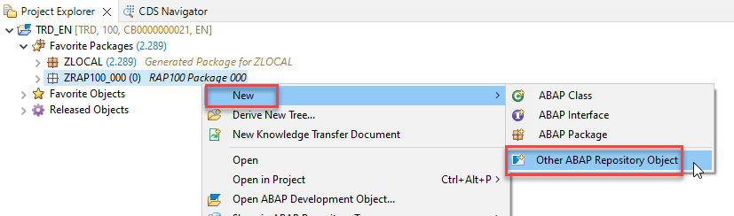 -->
   
   2. Search for **database table**, select it, and click **Next >**.

      <!-- 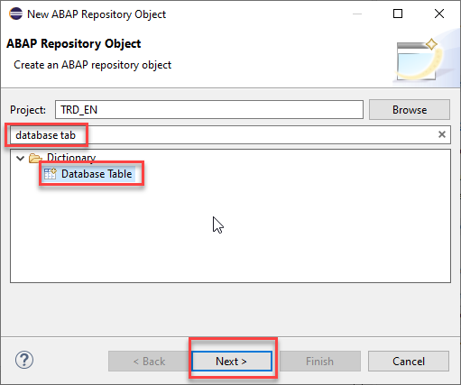 -->
   
   3. Maintain the required information (`###` is your group ID) and click **Next >**.
 
      - Name: **`ZTRAVEL_###`**
      - Description: _**`Travel data`**_                  
             
      <!-- 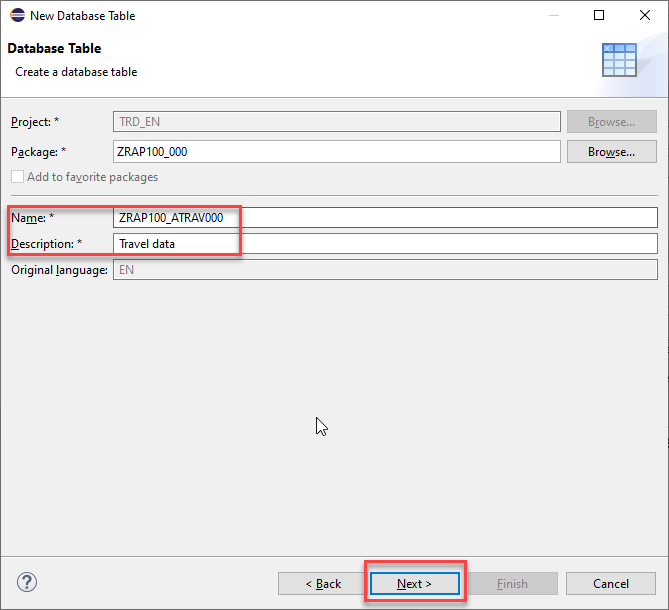 -->

   4. Select a transport request, and click **Finish** .
   
   5. Replace the default code with the code snippet provided below and make sure to replace all instances of the the placeholder **`###`** with your group ID using the **Replace All** function (**Ctrl+F**).    
 
      > ℹ️ **Hint**: Hover the code snippet and choose the _Copy raw contents_ icon  appearing in the upper-right corner to copy it. 
      
      <pre lang="ABAP">
      @EndUserText.label : 'Travel data'
      @AbapCatalog.enhancement.category : #NOT_EXTENSIBLE
      @AbapCatalog.tableCategory : #TRANSPARENT
      @AbapCatalog.deliveryClass : #A
      @AbapCatalog.dataMaintenance : #RESTRICTED
      define table ztravel_### {

        key client            : abap.clnt not null;
        key travel_id         : /dmo/travel_id not null;
        agency_id             : /dmo/agency_id;
        customer_id           : /dmo/customer_id;
        begin_date            : /dmo/begin_date;
        end_date              : /dmo/end_date;
        destination           : /dmo/city;
        @Semantics.amount.currencyCode : 'ztravel_### .currency_code'
        booking_fee           : /dmo/booking_fee;
        @Semantics.amount.currencyCode : 'ztravel_### .currency_code'
        total_price           : /dmo/total_price;
        currency_code         : /dmo/currency_code;
        description           : /dmo/description;
        status                : /dmo/travel_status;
        created_by            : abp_creation_user;
        created_at            : abp_creation_tstmpl;
        local_last_changed_by : abp_locinst_lastchange_user;
        local_last_changed_at : abp_locinst_lastchange_tstmpl;
        last_changed_at       : abp_lastchange_tstmpl;
      }
      </pre>
 
      <!-- 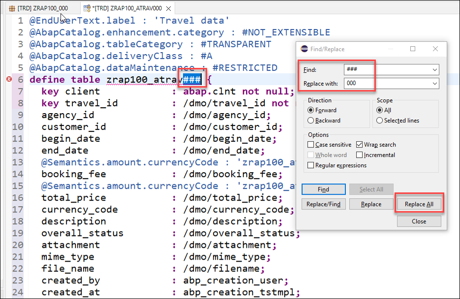 -->
      
   6. Save  and activate  the changes.
   
</details>

## Exercise 1.3: Create a data generator class
[^Top of page](#Introduction)

> Create the ABAP class **`ZCL_TRAVEL_GEN_DATA_###`** to fill the previously created database table with demo _travel_ data.

 <details>
  <summary>🔵Click to expand!</summary>

   1. Right-click on your ABAP package **`ZRAP120_AI_###`** and select **New** > **ABAP Class** from the context menu.

      <!-- 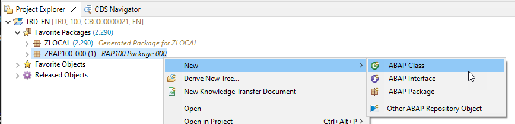 -->
   
   2. Maintain the required information (`###` is your group ID) and click **Next >**.
 
      - Name: **`ZCL_TRAVEL_GEN_DATA_###`**
      - Description: _**`Generate demo data`**_      
   
      <!-- 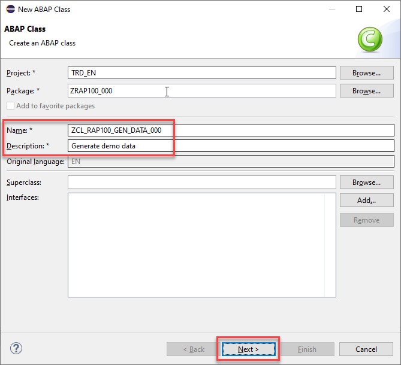 -->

   3. Select a transport request and click **Finish** to create the class.
   
   4. Replace the default source code with the following code snippet. Make sure to replace all instances of the placeholder **`###`** with your group ID using the **Replace All** function (**Ctrl+F**).

      <pre lang="ABAP">
      CLASS zcl_travel_gen_data_### DEFINITION
      PUBLIC
      FINAL
      CREATE PUBLIC .

      PUBLIC SECTION.
         INTERFACES if_oo_adt_classrun.

      PROTECTED SECTION.
      PRIVATE SECTION.
         METHODS: delete_demo_data.
         METHODS: generate_demo_data.

      ENDCLASS.

      CLASS zcl_travel_gen_data_### IMPLEMENTATION.
         METHOD if_oo_adt_classrun~main.
            me->delete_demo_data(  ).
            out->write( 'Table entries deleted' ).

            me->generate_demo_data(  ).
            out->write( 'Demo data was generated' ).
         ENDMETHOD.

         METHOD delete_demo_data.
            DELETE FROM ztravel_###.
            COMMIT WORK.
         ENDMETHOD.


         METHOD generate_demo_data.
            DATA: ls_travel TYPE ztravel_###,
                  lt_travel TYPE STANDARD TABLE OF ztravel_###.

            ls_travel-client = '100'.
            ls_travel-travel_id = '00000001'.
            ls_travel-agency_id = '070001'.
            ls_travel-customer_id = '000001'.
            ls_travel-begin_date = '20231101'.
            ls_travel-end_date = '20231110'.
            ls_travel-destination = 'Berlin'.
            ls_travel-booking_fee = '150.00'.
            ls_travel-total_price = '1200.00'.
            ls_travel-currency_code = 'EUR'.
            ls_travel-description = 'Business Trip to Berlin'.

            APPEND ls_travel TO lt_travel.
            CLEAR ls_travel.

            "Add more entries


            INSERT ztravel_### FROM TABLE @lt_travel.
            COMMIT WORK.

            CLEAR lt_travel.
         ENDMETHOD.

      ENDCLASS.
      </pre>

 
      > **Hint**: You can use the **ABAP Pretty Printer** (**ABAP Formatter**) function by pressing **Ctrl+Shift+F1** to format your source code. You will be requested to configure it, if this is the first time you use it on the system.
           
   5. Save  and activate  the changes.
   </details>


## Exercise 1.4: Generate mock data using Joule Predictive Code Completion💎
[^Top of page](#Introduction)

> Generate mock data using the **Joule Predictive Code Completion💎** feature in ADT.
>  
> You can toggle **Joule Predictive Code Completion** in the ADT toolbar .  
> Note that this icon only appears in the ADT tollbar when working in the relevant editors, such as the class editor: 
> 
> ⚠ **Warning regarding Joule's outputs** ⚠   
> Please be aware that the outputs generated by Joule in this exercise description may differ from yours, and the provided code snippets should be adjusted accordingly. **Always review the code generated by Joule**.

   <details>
   <summary>🔵Click to expand!</summary>
      
   1. Place the cursor after the comment _"Add more entries_ and press **Enter**. Joule will suggest the next lines of code based on the comment. 
 
      Review the code and press **Tab** or click on **Accept (Tab)** to accept the suggestion. Adjust it if needed!

   2. Once you think the code is correct, run the ABAP class. 
      
      For that, select your ABAP class **`ZCL_TRAVEL_GEN_DATA_###`**, select the run button > **Run As** > **ABAP Application (Console) F9** or press **F9**. 

      <!-- 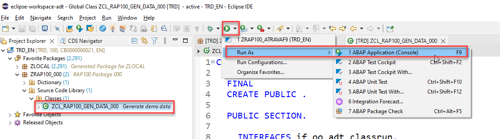 -->

      A message will be displayed _ABAP Console_.

      <!-- 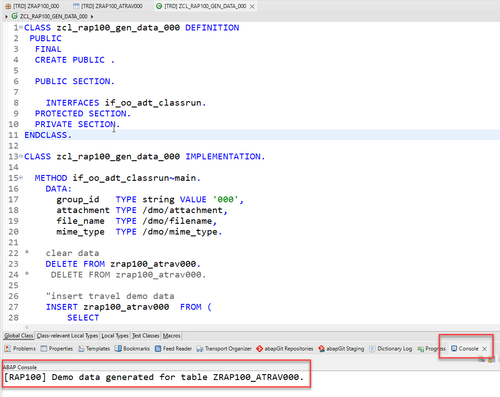 -->
      
   3. Open your database table **`ZTRAVEL_###`** and press **F8** to start the data preview and display the filled database entries, i.e. _travel_ data.
  
      

 </details>

## Exercise 1.5: Generate the transactional UI service
[^Top of page](#Introduction)

> Create your OData v4 based UI services along with the underlying RAP business object (BO) with all the needed ABAP artefacts - e.g. CDS view entities, behavior definition and implementation - using the built-in ADT generator.   
> 
> The generated business service will be transactional, draft-enabled, and enriched with UI semantics for the generation of the Fiori elements app.

  <details>
  <summary>🔵Click to expand!</summary>

   1. Right-click your database table **`ZTRAVEL_###`**  and select **Generate ABAP Repository Objects** from the context menu. 

       <!-- 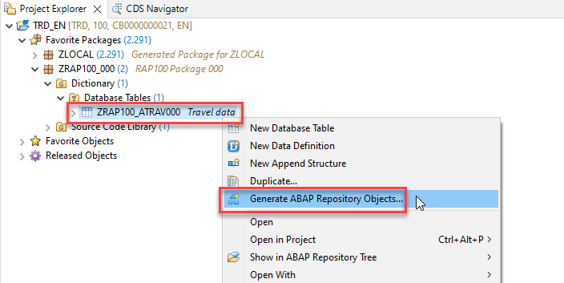    -->

   2. Select **OData UI Service** and click on **Next**.
 
   3. Enter the package **`ZRAP120_AI_###`** and click on **Next**.
 
   4. Maintain the required information on the **Configure Generator** dialog to provide the name of your data model and generate them.         

      For that, navigate through the wizard tree (_Business Objects_, _Data Model_, etc...), maintain the artefact names provided in the table below, 
      and press **Next >**.
 
      Verify the maintained entries and press **Next >** to confirm. The needed artefacts will be generated. 

      <!-- 
      > ℹ **Info about CDS Naming Conventions**     
      > The main aspects of the naming conventions of SAP S/4HANA's Virtual Data Model (VDM) are used in this exercise.  
      > More information on VDM can be found on the SAP Help portal: **[Here](https://help.sap.com/docs/SAP_S4HANA_CLOUD/0f69f8fb28ac4bf48d2b57b9637e81fa/8a8cee943ef944fe8936f4cc60ba9bc1.html)**. 
      -->
      
      > ⚠ **Attention** ⚠   
      > Please ensure that the names **match exactly** with those provided below. 
      > Doing this is important to ensure the correctness of the code snippets provided in the following exercises.
 
      
      | **RAP Layer**                          | **Artifacts**                   | **Artifact Names**                                            |
      |----------------------------------------|---------------------------------|---------------------------------------------------------------|
      | **Business Object**                    |                                 |                                                               |
      |                                        | **Data Model**                  | CDS Entity Name: **`ZR_TRAVEL_###`**                 |
      |                                        |                                 | CDS Entity Name Alias: **`Travel`**                           |  
      |                                        | **Behavior**                    | Implementation Behavior Class: **`ZBP_R_TRAVEL_###`**  |
      |                                        |                                 | Draft Table Name: **`ZTRAVEL_###_D`**                      |  
      | **Service Projection**                 | **Service Projection Entity**   | CDS Entity Name: **`ZC_TRAVEL_###`**                 |
      |                                        | **Service Projection Behavior** | Behavior Implementation Class: **`ZBP_C_TRAVEL_###`**|   
      | **Business Service**                   |                                 |                                                               |
      |                                        | **Service Definition**          | Service Definition Name: **`ZUI_TRAVEL_###_O4`**          |
      |                                        | **Service Binding**             | Service Binding Name: **`ZUI_TRAVEL_###_O4`**          |
      |                                        |                                 | Binding Type: **`OData V4 - UI`**                             |
                       
      <!-- 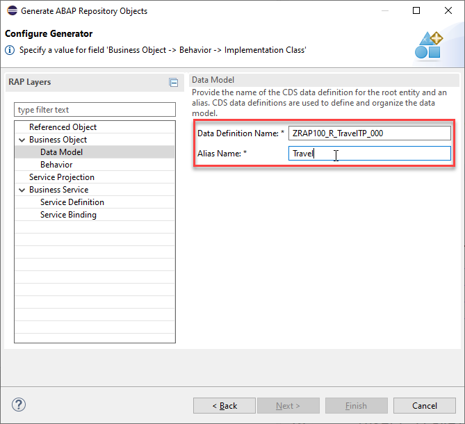-->

      <!-- 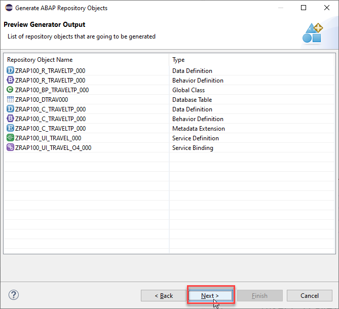-->

      <!-- 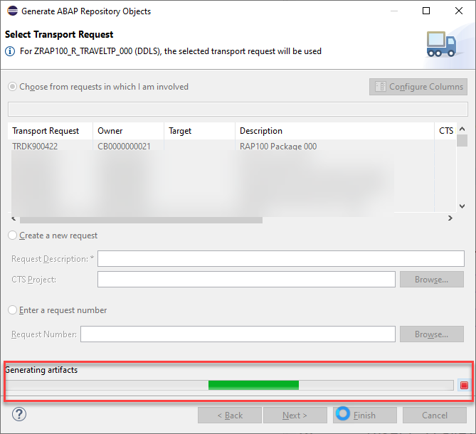-->
 
   2. Go to the **Project Explorer**, select your package **`ZRAP120_AI_###`**, refresh it by pressing **F5**, and check all generated ABAP repository objects 

      <!-- 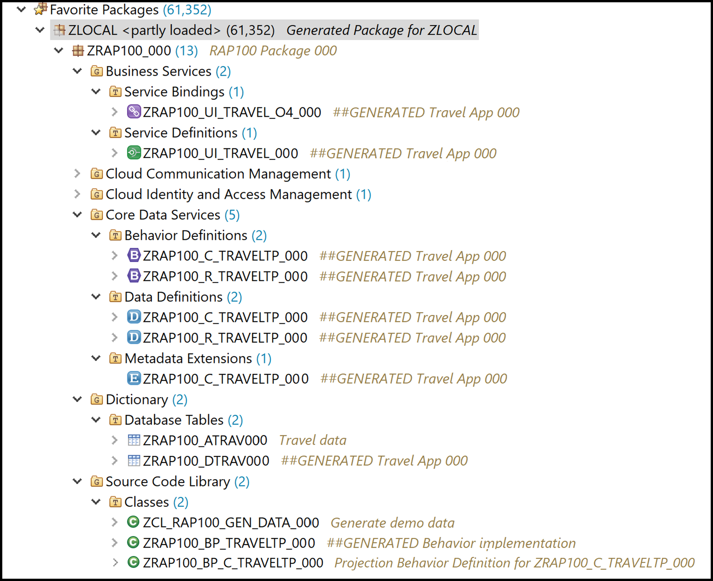   -->
      
<!-- Below is a brief explanation of the generated artifacts for the different RAP layers: Base BO, BO Projection, and Business Service.

---
  **Base Business Object (BO) `ZRAP100_R_TRAVEL_###`** 
  
   | **Object Name**               |  **Description**         |     
   |:----------------------------- |:------------------------ |
   | **`ZRAP100_R_TravelTP_###`**     | (aka _Base BO view_): This **data definition** defines the data model of the root entity _Travel_ which is the only  node of our business object).  |                      
   | **`ZRAP100_R_TravelTP_###`**   | (aka _Base BO behavior): This **behavior definition** contains the definition of the standard transactional behavior of the base _Travel_ BO entity. It is a _managed_ and _draft-enabled_ implementation.  |  
   | **`ZRAP100_DTRAV###`**   | (aka _Draft table_): This **database table** is used to temporary store the data from draft _travel_ instances at runtime. It is managed by the RAP framework.    |     
   | **`ZRAP100_BP_TRAVELTP_###`**  | (aka _Behavior pool_): This **ABAP class** which provides the implementation of the behavior defined in the behavior definition `ZRAP100_R_TravelTP_###` of the base _Travel_ BO.   |  
  
---
  **BO Projection `ZRAP100_C_TRAVEL_###`** 
  
  The BO projection represents the consumption specific view on the BO data model and behavior. 

   | **Object Name**               |  **Description**         |     
   |:----------------------------- |:------------------------ |
   | **`ZRAP100_C_TravelTP_###`**   | (aka _BO projection view_): This **data definition** is used to define the projected data model of the root entity _Travel_ relevant for the present scenario. Currently almost all fields of the underlying base BO view are exposed and the definition of metadata extension is allowed using the view annotations `@Metadata.allowExtensions: true`.  |           
   | **`ZRAP100_C_TravelTP_###`**   | (aka _BO behavior projection_): This **behavior definition** exposes the part of the underlying base _Travel_ BO entity which is relevant for the present scenario with the keyword **`use`**. Currently all standard CUD operations are exposed.  |        
   | **`ZRAP100_C_TravelTP_###`**   | This **metadata extension** is used to annotate view `ZRAP100_C_TRAVEL_###` and its elements with UI semantics via CDS annotations. |        
   
---
  **Business Service** 

   | **Object Name**               |  **Description**         |     
   |:----------------------------- |:------------------------ |
   | **`ZRAP100_UI_TRAVEL_###`**  | A service definition is used to define the relevant entity sets for our service and also to provide local aliases if needed. Only the _Travel_ entity set is exposed in the present scenario. |                      
   | **`ZRAP100_UI_TRAVEL_O4_###`**  | This service binding is used to expose the generated service definition as OData V4 based UI service. Other binding types (protocols and scenarios) are supported in the service binding wizard.  |  
   
--- -->
 </details>

## Exercise 1.6: Publish and preview the Travel app
[^Top of page](#Introduction)

> Publish the local service endpoint of your service binding **`ZUI_TRAVEL_###_O4`**  and start the _Fiori elements App Preview_ in ADT.  
>

 <details>
  <summary>🔵Click to expand!</summary>

   1. Open your service binding **`ZUI_TRAVEL_###_O4`** and click **Publish**.
   
   2. Double-click on the entity **`Travel`** in the **Entity Set and Association** section to open the _Fiori elements App Preview_.
     
       <!-- 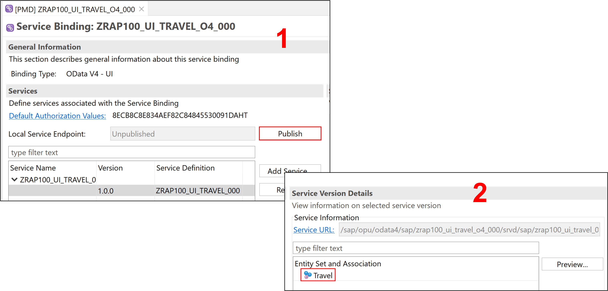 -->
   
   3. Click the button on the _Travel_ app **Go** to load the data.
       
   4. Check your result.
       <!-- 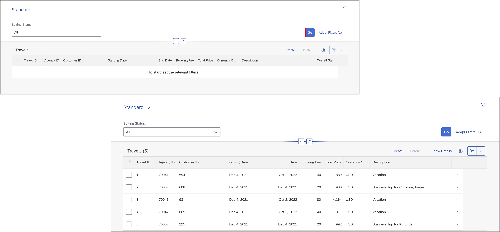 -->
 
</details>

## Exercise 1.7: Create an helper class
[^Top of page](#Introduction)

> Create the ABAP helper class **`ZCL_TRAVEL_HELPER_###`** that will contain common business logic that can be consumed by different business objects and methods - for example, in determinations or validations within our RAP application. 
> 
> This approach will allow the centralization of unit tests avoiding the need to maintain them within each individual business object.

<details>
  <summary>🔵Click to expand!</summary>

  1. Right-click on your package **`ZRAP120_AI_###`** and select **New > ABAP Class**
     -  Name: **`ZCL_TRAVEL_HELPER_###`**
     -  Description: **`Travel helper class ###`**

  2. Copy and paste the following code
     
     > ℹ️**Reminder**: Don't forget to replace the suffix placeholder **`###`** with your chosen or assigned group ID 

     ```ABAP
     CLASS zcl_travel_helper_### DEFINITION
      PUBLIC
      FINAL
      CREATE PUBLIC .

      PUBLIC SECTION.
        INTERFACES if_oo_adt_classrun.
        METHODS: validate_customer IMPORTING iv_customer_id TYPE /dmo/customer_id RETURNING VALUE(rv_exists) TYPE abap_bool.
        METHODS: get_booking_status IMPORTING iv_status TYPE /dmo/booking_status_text RETURNING VALUE(rv_status) TYPE /dmo/booking_status.


      PROTECTED SECTION.
      PRIVATE SECTION.
     ENDCLASS.


     CLASS zcl_travel_helper_### IMPLEMENTATION.
 
      METHOD if_oo_adt_classrun~main.
         "We will use this method to test the ABAP AI SDK
      ENDMETHOD. 

      METHOD validate_customer.
        rv_exists = abap_false.
        SELECT FROM /dmo/customer FIELDS customer_id
            WHERE customer_id = @iv_customer_id
        INTO TABLE @DATA(customers).

        IF customers IS NOT INITIAL.
          rv_exists = abap_true.
        ENDIF.
      ENDMETHOD.

      METHOD get_booking_status.
        CASE iv_status.
          WHEN 'Booked'.
            rv_status = 'B'.
          WHEN 'New'.
            rv_status = 'N'.
          WHEN 'Cancelled'.
            rv_status = 'X'.
        ENDCASE.
      ENDMETHOD.

     ENDCLASS.
     ```
 
  3. Save  and activate  the changes.

</details>
  
## Summary & Next exercise
[^Top of page](#Introduction)

Now that you've... 
- created an ABAP package,
- created a database table and fill it with demo data using **Predictive Code Completion**,
- created a transactional UI service,
- published a local service point, and started the _Fiori elements App Preview_ in ADT, and
- created an helper class,

you can continue with the next exercise - **[Exercise 2: Enhance the CDS data model and create CDS unit tests](../ex02/README.md)**.

---
